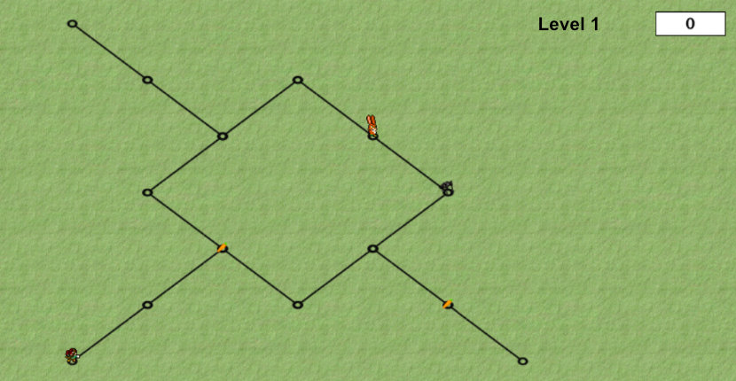

# Carrots Hunting

**Carrots Hunting** is a game about collecting carrots with a rabbit on a game field, without being eliminated by enemies in the form of archers and wolves.



## :dart: Features

* Multiple levels
* Design of own levels
* Pattern movement for NPCs
* Collision detection of players

## :rocket: Getting Started

### :wrench: Installation

To play this game, you just need to download and install [Greenfoot](https://www.greenfoot.org) according to the instructions.

### :computer: Usage

Open Greenfoot and import *CarrotsHunting*. Then compile this game and run it by clicking the button labeled *Run*.

## :eyes: Examples

### :large_orange_diamond: Designing Your Own Level

To build your own level, you need to define a text file following a certain scheme:

```
{{""},{""},{""},{""},{""},{""},{""},{""},{""}},
{{""},{""},{""},{""},{""},{""},{""},{""},{""}},
{{""},{""},{""},{""},{""},{""},{""},{""},{""}},
{{""},{""},{""},{""},{""},{""},{""},{""},{""}},
{{""},{""},{"GSE"},{""},{""},{""},{""},{""},{""}},
{{""},{""},{"GNWSE"},{""},{""},{""},{""},{""},{""}},
{{""},{""},{"GNW","GSE"},{""},{""},{""},{""},{""},{""}},
{{""},{""},{"GNWSE"},{""},{""},{""},{""},{""},{""}},
{{"GSW","GSE"},{"GSWNE"},{"GNW","GNE","GSW"},{"GSWNE"},{"GNE","GSE"},{""},{""},{""},{""}},
{{"GNWSE"},{""},{""},{""},{"GNWSE"},{""},{""},{""},{""}},
{{"GSE","GNW"},{""},{""},{""},{"GSW","GSE","GNW"},{"GSWNE"},{"GSW","GNE"},{"GSWNE"},{"GNE"}},
{{"GNWSE"},{""},{""},{""},{"GNWSE"},{""},{""},{""},{""}},
{{"GSW","GNW"},{"GSWNE"},{"GSE","GNE","GSW"},{"GSWNE"},{"GNE","GNW"},{""},{""},{""},{""}},
{{""},{""},{"GNWSE"},{""},{""},{""},{""},{""},{""}},
{{""},{""},{"GNW","GSE"},{""},{""},{""},{""},{""},{""}},
{{""},{""},{"GNWSE"},{""},{""},{""},{""},{""},{""}},
{{""},{""},{"GNW"},{""},{""},{""},{""},{""},{""}}
1
1
8 
1 
1
```

The first sequence describes the grid layout using coordinates. The following values describe the location for eliminated players: *origin x*, *origin y*, *initial position*, *increment of mover*, and *direction of rotation*.

### :large_orange_diamond: Using the Optional Server

Furthermore, there is a server in the directory *Server* that manages likes by users. In order to use this server, it must be compiled and started via `java -jar Server.jar`. The game will then try to establish a connection for communicating. The server can be terminated via the command `stop`.

## :white_check_mark: Tests

In addition to **UI tests** such as reading levels, various **unit tests** were performed: The corresponding test classes have the suffix *Test* and can be executed directly in Greenfoot.

## :book: Documentation

Analogous to the tests, the documentation can also be accessed directly in Greenfoot. For this purpose, open the source code of a respective file and simply switch to the documentation.

## :warning: License

Carrots Hunting is licensed under the terms of the [MIT license](LICENSE.txt).

## :trophy: Award

Carrots Hunting took 2nd place for **Best Game** of the student course *Praktische Informatik 1* at University of Bremen in 2016.
